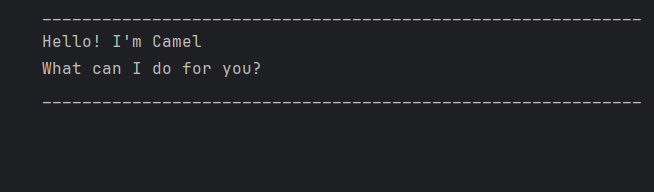
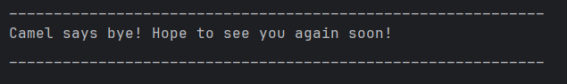

# Camel User Guide



Hello! I am Camel :), a smart todo list helping you to manage your ever-growing list of todos, deadlines and 
events!

Read on to find out more what I can do!

## Tasks

There are three types of tasks that you can have: Todos, Deadlines and Events

### Todos

These are general tasks without any deadlines :) You can take your time to do them!

### Deadlines

These are tasks which are urgent and have a deadline that you specify! Better make sure to do them quick!

### Events

These are events that you busy person have to attend to. Add them in so you don't forget!

## Adding Tasks

### Adding Todos

Simply enter your task after the `todo` keyword.

Example: `todo read a book`

```
    Camel has added this task :)
    [T][ ] read a book
    You now have 1 task(s).
```

### Adding Deadlines

Enter your task, followed by the `/by` command and the task deadline in `yyyy-mm-dd hh:ss` format.

Example: `deadline CS2113 iP /by 2025-03-14 23:59`

```    
    Camel has added this task :)
    [D][ ] CS2113 iP (by: 2025-03-14 23:59)
    You now have 2 task(s).
```

*Not to worry if you cannot remember the syntax!* If you type it wrongly, Camel will remind you!

`>>> deadline argh`
```
    I don't understand :( Please ensure the format is as follows: "deadline <name> /by <time>"
```

### Adding Events

This is similar to adding deadlines, but specify the start time and end time using `/from` and `/to`!

Example: `event CS2113 lecture /from 2025-03-14 16:00 /to 2025-03-14 18:00`

```	
    Camel has added this task :)
    [E][ ] CS2113 lecture (from: 2025-03-14 16:00 to: 2025-03-14 18:00)
    You now have 3 task(s).
```

## Viewing Tasks

You can view all Todos, Deadlines and Events that you have by typing in `list`

```
    Of course! Camel shall gladly retrieve your tasks :)
    1.[T][ ] read a book
    2.[D][ ] CS2113 iP (by: 2025-03-14 23:59)
    3.[E][ ] CS2113 lecture (from: 2025-03-14 16:00 to: 2025-03-14 18:00)```
```

## Marking Tasks

Once you've slayed your goal, type `mark <index>` to mark a task as being done! Use the index of the task on the list!

Example `mark 1`

```
    Nice! Camel has marked this task as done :)
    [T][X] read a book
```

The `[X]` indicates that your task is done!

*(Note: the `[T]` indicates the type of task, whether it's a* `[T]`odo, `[D]`eadline, or `[E]`vent)

## Unmarking Tasks

If you've been overzealous, you can undo marking a task by unmarking it using `unmark <index>`.

Example `unmark 1`

```
    Ok, Camel has marked this task as not done yet :)
    [T][ ] read a book
```

## Finding Tasks

In case you have forgotten that one specific task, you can search for tasks using `find <search key>`. Camel will 
return you a list of all tasks that contain the key!

Example `find CS2113`

```
    Of course! Camel shall gladly retrieve your tasks :)
    1.[D][ ] CS2113 iP (by: 2025-03-14 23:59)
    2.[E][ ] CS2113 lecture (from: 2025-03-14 16:00 to: 2025-03-14 18:00)
```

## Help

Of course, if you've forgotten any command, you can bring up the help screen by typing `help`!

```
    Available commands: {todo, deadline, event, list, mark, unmark, delete, find, bye, help}
```

## Bye

Once you're done for the day, don't forget to bid Camel goodbye by typing `bye`. Camel will then automatically save
your task list to disk, and the next time you start Camel up you can see your previous tasks!

